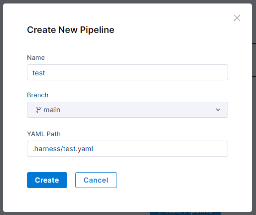
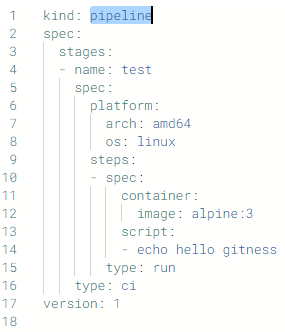
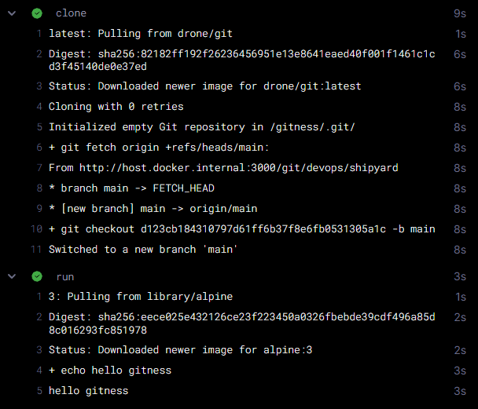
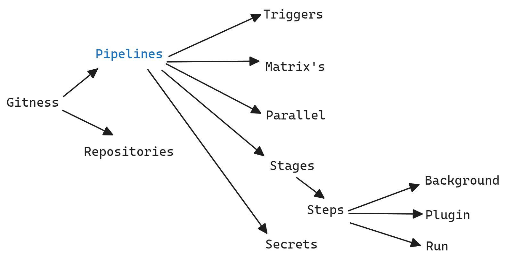
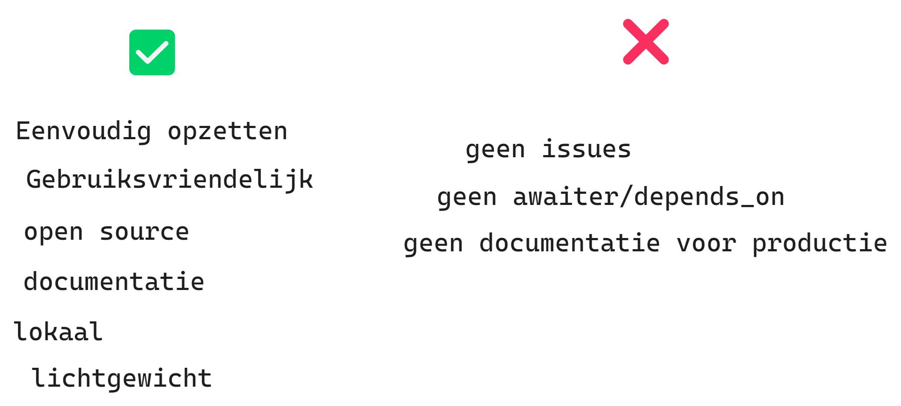
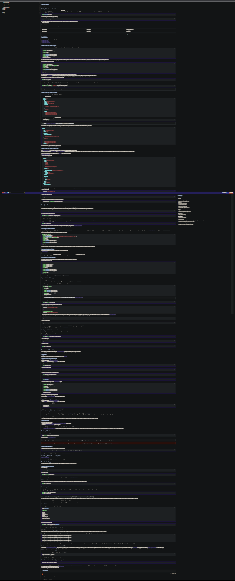

# Gitness as an Alternative Version Control System?

_Maarten van der Lei, 2023_

## Introduction

<span style="font-size:3rem;">I</span>n the world of DevOps, speed, stability, and efficiency of software development are central. That's why the use of a version control system like Git is a must. </br>
**Gitness** _(Gitness, 2023)_ is a tool that simplifies the use of Git. This research explores what Gitness is, how it works, its advantages and disadvantages, and how it compares to other version control systems. </br>
<i>Why an alternative based on Git?</i> Because Git is the foundation of the DevOps structure, and since DevOps is all about change and adaptation, it's important to look at alternatives that make Git usage easier. </br>

Below are the features of Gitness: </br>

## Main Question

In this blog post, we will answer the following main question: </br>

How can Gitness be used as an alternative version control system for Git? </br>

## What is Gitness?

In a nutshell, **Gitness** is an open-source, self-hostable Git server with a web interface and pipeline functionality. It serves as an alternative to Gitlab and Github, but it emphasizes a simpler interface and lightweight functionality. It allows for storing and managing code and running automated DevOps pipelines.

Essentially, Gitness is a platform that combines the power of code hosting and automated continuous integration pipelines. It enables users to run Git repositories locally and provides a web interface for access. This tool is designed to streamline the development workflow and make it easier to manage and integrate code in a DevOps environment.

### Small Facts

**Gitness** is relatively new, as it was released by **Harness**.io on September 21, 2023, but work had been ongoing prior to that. </br>

**Gitness** is developed in the Go programming language, making it well-suited for the Docker environment in which it runs. </br>
It is an open-source project maintained by [Harness (Harness Github, 2023)](https://github.com/harness/).

## How Does Gitness Work?

Gitness is an open-source, self-hostable Git server with a web interface and pipeline functionality. Gitness is easy to start using Docker. </br>

Below is the command to start Gitness: </br>


This has been translated into a docker-compose.yml file, as shown below: </br>

```yaml
name: gitness
services:
  ship:
    image: harness/gitness:latest
    ports:
      - 3000:3000
    volumes:
      - /var/run/docker.sock:/var/run/docker.sock
      - /tmp/gitness:/data
      - gitness:/app
    restart: always
volumes:
  gitness: {}
```

In this file, volumes are created to store and use Gitness data when the container is restarted. </br>

<hr />

When you start the Docker container with the following command: `docker-compose up -d` </br>
Gitness can be accessed at `http://localhost:3000/` after creating an account and logging in. </br>
Afterward, you will arrive at the Gitness homepage: </br>


You can then create a repository, and you will have the following options: </br>


These options are not much different from what we are accustomed to on Github and Gitlab. </br>
Within the pipelines, it is possible to create a pipeline with a YAML structure. </br>
What stands out here is the absence of tickets/issues or discussions. In this way, you are forced to use another tool to manage tickets/issues and discussions. </br>

<hr />

### Pipelines

**Below is an example of a pipeline that you can create within Gitness:** </br>

<section style="display:flex; gap:1rem; flex-wrap: wrap;">
<div style="flex-grow:1;">
Pipelines can be easily created through the web interface, as shown below: </br>

</div>
<div style="flex-grow:1;">
Then a YAML structure is created, as shown below: </br>

</div>
<div style="flex-grow:1;">
You can then easily start the pipeline through the web interface as shown below: </br>

</div>
<div style="flex-grow:1;">
The results you see are almost identical to the results you get with Gitlab and Github. </br>

</div>
<span style="font-size:2rem;">T</span>riggers can be used to conditionally run your pipeline automatically. Think of creating a new tag or pushing to the repository. This fits well within the DevOps structure because you don't have to manually start the pipeline. </br>

</div>
</section>

#### Deep Dive

Since there is a lot of information about pipelines in the [Documentation (Gitness, 2023)](https://docs.gitness.com/) of Gitness, this is a summary of the key points. </br>
Pipelines within Gitness run using docker images and are therefore easy to create and use. </br>

In the pipeline's YAML, you can use the following aspects: </br>

- Matrix, to run multiple versions of your pipeline. </br>
- Secrets, to store sensitive information. </br>
- Parallel, to run multiple steps concurrently. </br>
- Stages, to group steps. </br>
- Steps, to define steps. </br>
  - Background, this step runs in the background, and the exit code is ignored. </br>
  - Plugins, this step runs a pre-defined plugin. </br>
  - Run, this step runs a command in a shell. This is the most commonly used step in your pipeline. </br>
- Triggers, as mentioned briefly above, you can use triggers, such as: `when: build.action == "pullreq_created"`

For this, I have created the following image: </br>


Since the pipelines run using docker images, it's possible to create and use your own image. </br>
Gitness provides examples of commonly used images/languages on its documentation site, see the [samples](https://docs.gitness.com/category/samples). </br>

This way, you can create a pipeline that, for example, runs a Postgres database in the background and tests a NodeJS application that uses the Postgres database. </br>

Below is an example from the documentation: </br>

```

yaml
kind: pipeline
spec:
  stages:
    - type: ci
      # only run if a pull request is created, possible at stage and step level
      when: build.action == "pullreq_created"
      spec:
        steps:
          - name: database
            # type: background, run, plugin
            type: background
            spec:
              # docker image running in the container
              container:
                image: postgres:latest
                pull: if-not-exists
              # pass environment variables to the container
              env:
                POSTGRES_PASSWORD: password
          - name: test
            type: run
            # create a matrix with different node versions
            strategy:
              type: matrix
              spec:
                axis:
                  node_version: ["18", "20"]
            spec:
              container: node:${{ matrix.node_version }}
              # shell command to be executed
              script: |-
                node -e "console.log('Hello world with node ${{ matrix.node_version }} ')"
```

Although the above YAML is structured as an example, it is best practice to wait for the database to start up. Gitness does not provide a solution for this, so you will need to use a waiter that polls the database, especially for databases like PostgreSQL.

#### Drone

Drone is the methodology through which Gitness runs pipelines. It is an open-source project by Harness.io. When a pipeline is started, a container with the drone-cli is launched, which is used to run the pipeline. You can then use a Docker image of your choice to run your pipeline.

## What Is the Community Support for Gitness?

Gitness has an active community, as seen in the number of open versus closed issues on Github. On Github, Gitness has a total of `27k` stars and 2.7k forks, indicating that it is a popular project.

The documentation for Gitness is extensive and easy to understand. For pipelines, you can easily find keys in the documentation, such as `stage.type.group`, which refers to the documentation if you set the type of your stage to `'group'`.

## What Are the Pros and Cons of Gitness?

Gitness has several pros and cons compared to the standards of Github and Gitlab. With Gitness, you can easily set up and run a pipeline, but it does not allow you to manage tickets/issues or discussions. Additionally, Gitness is very lightweight and easy to set up, but it does not allow you to install external plugins.

Gitness is open source and maintained by a large community, but it is not as large as Github or Gitlab.

One drawback I encountered is the lack of two things: a waiter (to wait for a container to start), and when you run Gitness locally in Docker, it's not possible to access the web interface from another machine without configuration, and this is not documented.

The biggest advantage of Gitness in my opinion is the ease of setting it up, especially locally and quickly.

To summarize, here are the pros and cons of Gitness:

**Pros**:

- Easy to set up
- User-friendly
- Comprehensive documentation
- Simple pipelines
- Local Git environment
- Clean web UI
- Open source
- Active community

**Cons**:

- No tickets/issues
- No discussions
- No external plugins for additional functionality like waiters or tickets
- Solution for external access not documented (how to change the port, modify the GIT URL for production use, etc.)

I have created an image to illustrate this: </br>


## How Does Gitness Compare to Other Version Control Systems?

Gitness is an alternative to Gitlab and Github, but it emphasizes a simpler interface and lightweight functionality. In that regard, Gitness is a good alternative as a version control system. However, where Gitness truly stands out is in its pipeline functionality. Here, Gitness is easy to use. But while Github and Gitlab make it easier to have an all-in-one solution for complete project management, Gitness is primarily a version control and pipeline tool.

### Installation

The difference in installation is significant. Gitness can be set up within 30 seconds using Docker, whereas Gitlab requires reading several pages of text to set up. See the installation of Gitlab: </br>


And the installation of Gitness: </br>


## Conclusion

Gitness is a good alternative to Gitlab and Github, with an emphasis on a simpler interface and lightweight functionality. So, if you are looking for an alternative Git solution, Gitness is a good choice. However, Gitness is not the right choice if you are looking for a complete project solution like Github and Gitlab offer, with tickets/issues and discussions.

## Sources

The following sources in APA format were used while writing this blog post:

- Gitness Homepage, October 1, 2023, Gitness, retrieved on October 1, 2023, from [gitness.com](https://gitness.com/)
- Gitness Docs, October 2, 2023, Gitness Docs, retrieved on October 2, 2023, from [docs.gitness.com](https://docs.gitness.com/)
- Gitness Github, October 3, 2023, Gitness Github, retrieved on October 3, 2023, from [github.com/harness/gitness](https://github.com/harness/gitness/)
- Harness Github, October 2, 2023, Harness Github, retrieved on October 2, 2023, from [github.com/harness](https://github.com/harness/)
- Gitlab installation self-hosting, Gitlab Self Hosting, retrieved on September 30, 2023, from [docs.gitlab.com](https://docs.gitlab.com/ee/install/docker.html#install-gitlab-using-docker-compose)
- Gitness product blog, Harness.io, retrieved on September 30, 2023, from [harness.io](https://www.harness.io/blog/gitness-your-ultimate-open-source-development-platform)
- Drone CLI, Drone.io by harness, retrieved on October 5, 2023, from [docs.drone.io](https://docs.drone.io/cli/install/)

_Please note that this blog was fully translated by ChatGPT and therefore may contain mistakes._ <br />
_This blog was written for the minor: DevOps, please act accordingly._
