# Gitness als alt. Versiebeheersysteem?

_Maarten van der Lei, 2023_ </br>
Link to self: [blog](https://github.com/m10rten/devops-gitness) </br>

## Inleiding

<section style="display: flex; gap:1rem;">

<p> 
<span style="font-size:3rem;">I</span>n de wereld van DevOps staat snelheid, stabiliteit en efficientie van de softwareontwikkeling centraal. Daarom is het gebruik van een versiebeheersysteem zoals Git een must. </br>
<b>Gitness</b> <i>(Gitness, 2023) (Zie afbeelding rechts)</i> is een tool die het gebruik van Git eenvoudiger maakt. In dit onderzoek wordt er gekeken naar wat Gitness is, hoe het werkt, wat de voor- en nadelen zijn en hoe het zich verhoudt ten opzichte van andere versiebeheersystemen. </br>
<i>Waarom een alternatief op basis van Git?</i> Omdat Git de grondlegging is van de DevOps structuur en DevOps staat voor verandering en aanpassing, is het belangrijk om te kijken naar alternatieven die het gebruik van Git eenvoudiger maken. </br>
</p>

</section>

Onderstaand de features van Gitness: </br>
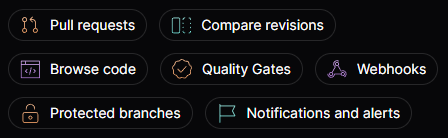

## Hoofdvraag


In deze blogpost wordt er antwoord gegeven op de volgende hoofdvraag: </br>

Hoe kan Gitness ingezet worden als alternatief versiebeheersysteem voor Git? </br>
Dit wordt gedaan aan de hand van de ICT Research Methods Pack _(ICTResearchMethodsPack, 2023)_ (Zie afbeelding rechts).

Deze wordt beantwoord aan de hand van de volgende deelvragen: </br>

## Wat is Gitness?

In een notendop is **Gitness** is een open-source, zelf-hostbare Git-server met een webinterface en pipeline-functionaliteit.
Het dient als een alternatief voor Gitlab en Github, maar legt de nadruk op een eenvoudigere interface en lichtgewicht functionaliteit.
Het biedt de mogelijkheid om code op te slaan en te beheren, evenals geautomatiseerde DevOps-pipelines uit te voeren.
Ik heb deze informatie uit de [PRNewsWire 'news-releases'](https://www.prnewswire.com/news-releases/harness-releases-gitness--open-source-git-platform-301934938.html) (PRNewsWire, provided by Harness, 2023), waarin ik voor het eerst de voor mij onbekende tool tegenkwam en leerde dat Gitness van het open source bedrijf Harness.io is. </br>

In essentie is Gitness een platform dat de kracht van code-hosting en geautomatiseerde continue integratiepipelines combineert.
Het stelt gebruikers in staat om Git-repositories lokaal te draaien en biedt een webinterface voor toegang.
Deze tool is ontworpen om de ontwikkelingsworkflow te stroomlijnen en maakt het gemakkelijker om code te beheren en te integreren in een DevOps-omgeving.
Samengevat van de [blog van TechTarget](https://www.techtarget.com/searchsoftwarequality/news/366552837/New-Git-repository-faces-corporate-open-source-doubts), (TechTarget, 2023). </br>

### Kleine feitjes


**Gitness** is vrij nieuw, op 21-sept-23 bracht **Harness**.io Gitness uit, daarvoor werd er al wel aan gewerkt. </br>

**Gitness** is gemaakt in de Go programeertaal en sluit daarmee goed aan op de docker omgeving waarin het draait. </br>
Het is een open source project en wordt onderhouden door [Harness (Harness github, 2023)](https://github.com/harness/).

## Hoe werkt Gitness?

Gitness is een open-source, zelf-hostbare Git-server met een webinterface en pipeline-functionaliteit.
Gitness is eenvoudig op te starten met behulp van Docker. </br>

Zie hieronder het commando om Gitness te starten: </br>
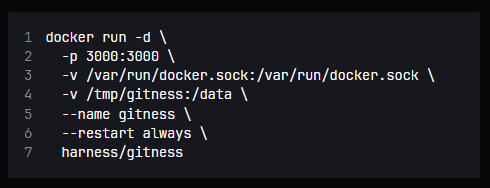

Dit is vertaald naar een docker-compose.yml bestand, zie hieronder: </br>

```yaml
name: gitness
services:
  ship:
    image: harness/gitness:latest
    ports:
      - 3000:3000
    volumes:
      - /var/run/docker.sock:/var/run/docker.sock
      - /tmp/gitness:/data
      - gitness:/app
    restart: always
volumes:
  gitness: {}
```

In dit bestand worden volumes aangemaakt om zo de data van gitness te bewaren en te gebruiken als de container opnieuw wordt opgestart. </br>

<hr />

Wanneer je dan de docker container opstart met het volgende commando: `docker-compose up -d` </br>
Dan is Gitness te bereiken op `http://localhost:3000/`. </br>
Na het aanmaken van een account en het inloggen, kom je op de homepagina van Gitness: </br>
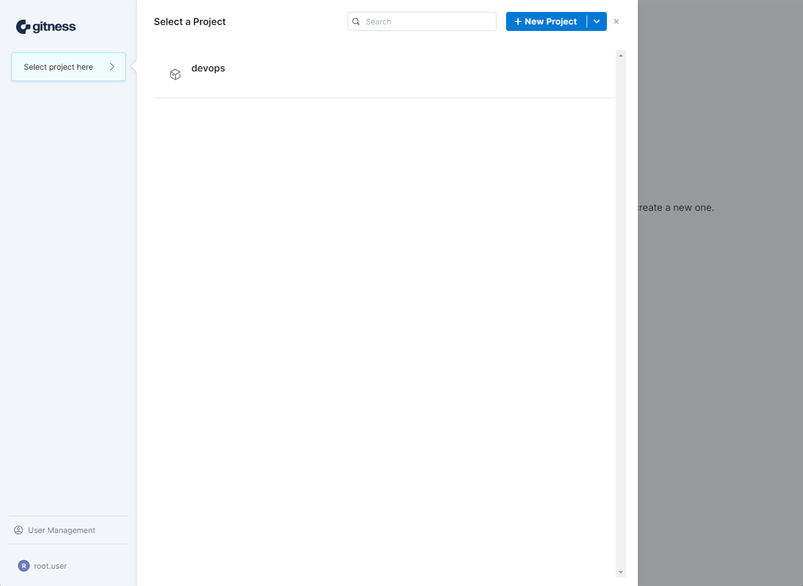

Vervolgens kun je een repository aanmaken en dan krijg je de volgende opties: </br>

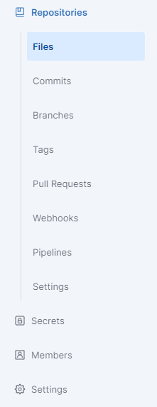

Deze opties zijn niet veel anders dan we van Github en Gitlab gewend zijn. </br>
Binnen de pipelines is het mogelijk om een pipeline te maken met een een YAML structuur. </br>
Wat hier wel opvalt is de afwezigheid van tickets/issues of discussies. Op deze manier ben je dus genoodzaakt om een andere tool te gebruiken voor het beheren van tickets/issues en discussies. </br>

<hr />

### Pipelines

**Onderstaand is een voorbeeld van een pipeline die je kan maken binnen Gitness:** </br>

<section style="display:flex; gap:1rem; flex-wrap: wrap;">
<div style="flex-grow:1;">
Pipelines kunnen eenvoudig aangemaakt worden via de webinterface, zie hieronder: </br>
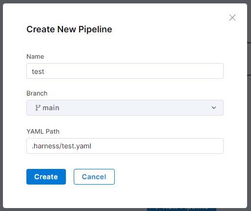
</div>
<div style="flex-grow:1;">
Er wordt dan een YAML structuur aangemaakt, zie hieronder: </br>
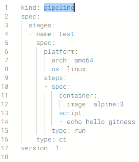
</div>
<div style="flex-grow:1;">
Waarna je eenvoudig de pipeline kan starten via de webinterface zoals onderstaand: </br>
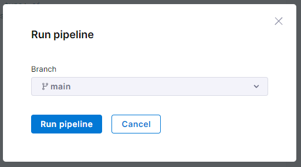
</div>
<div style="flex-grow:1;">
De resultaten die je dan te zien krijgt zijn vrijwel identiek aan de resultaten die je krijgt bij Gitlab en Github. </br>

</div>
<span style="font-size:2rem;">T</span>riggers kan je gebruiken om conditioneel je pipeline automatische te laten runnen. Denk hierbij aan het maken van een nieuwe Tag, of het pushen naar de repository. Dit past goed binnen de DevOps structuur omdat je dan niet handmatig de pipeline hoeft te starten. </br>
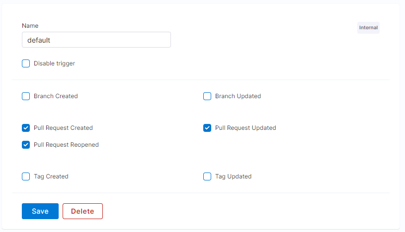
</div>
</section>

#### Deep dive

Omdat er in de [Documentatie (Gitness, 2023)](https://docs.gitness.com/) van Gitness veel te vinden is over de pipelines, is dit een samenvatting van de belangrijkste punten. </br>
Pipelines binnen Gitness draaien via docker images en zijn daarmee eenvoudig te maken en te gebruiken. </br>

In de YAML van de pipeline is het mogelijk om de volgende aspecten te gebruiken: </br>

- Matrix, om meerdere versies te runnen van je pipeline. </br>
- Secrets, om gevoelige informatie op te slaan. </br>
- Parallel, om meerdere stappen tegelijk te runnen. </br>
- Stages, om stappen te groeperen. </br>
- Steps, om stappen te definiëren. </br>
  - Background, deze stap runt in de achtergrond, exit code wordt genegeerd. </br>
  - Plugins, deze stap runt een plugin die vooraf gedefinieerd is. </br>
  - Run, deze stap runt een commando in een shell. Dit is de meest gebruikte stap binnen je pipeline. </br>
- Triggers, bovenstaand werd al even kort stilgestaan bij triggers, maar hieronder een voorbeeld: </br>
  - Daarmee kan je bijvoorbeeld in een `step` een conditie maken als: `when: build.action == "pullreq_created"`

Hiervoor heb ik het volgende plaatje gemaakt: </br>
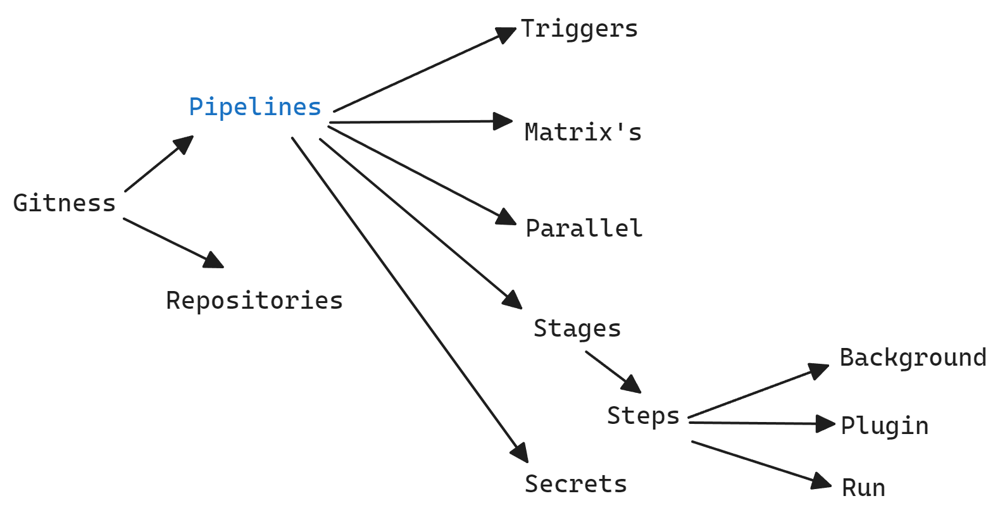

Omdat de pipelines draaien via docker images, is het mogelijk om een eigen image te maken en te gebruiken. </br>
Gitness biedt dan ook via de documentatie site voorbeelden aan van veelgebruikte images/talen, zie de [samples](https://docs.gitness.com/category/samples). </br>

Op deze manier is het mogelijk om een pipeline te maken die bijvoorbeeld een Postgres database in de achtergrond draait en een NodeJS applicatie test die gebruik maakt van de Postgres database. </br>

Zie hieronder een voorbeeld vanuit de documentatie: </br>

```yaml
kind: pipeline
spec:
  stages:
    - type: ci
      # alleen runnen als een pull request is aangemaakt, mogelijk op stage en step niveau
      when: build.action == "pullreq_created"
      spec:
        steps:
          - name: database
            # type: background, run, plugin
            type: background
            spec:
              # docker image die in de container draait.
              container:
                image: postgres:latest
                pull: if-not-exists
              # geef environment variabelen mee aan de container
              env:
                POSTGRES_PASSWORD: password
          - name: test
            type: run
            # maak een matrix aan met verschillende versies van node
            strategy:
              type: matrix
              spec:
                axis:
                  node_version: ["18", "20"]
            spec:
              container: node:${{ matrix.node_version }}
              # shell commando wat uitgevoerd wordt.
              script: |-
                node -e "console.log('Hello world with node ${{ matrix.node_version }} ')"
```

Al hoewel bovenstaande YAML opgebouwd is als voorbeeld, is het een best-practice om eerst te wachten tot de database klaar is met opstarten. </br>
Daar heeft Gitness geen oplossing voor, daarom zal je zelf, voor bijvoorbeeld postgres, een waiter moeten gebruiken die polled op de database. </br>

#### Drone

Drone is de methodiek waarmee Gitness de pipelines runt, dit is een open source project van Harness.io. </br>
Wanneer een pipeline wordt gestart, dan wordt er een container opgestart met de drone-cli, deze cli wordt gebruikt om de pipeline te runnen. </br>
Je kan dan je een docker image naar keuze gebruiken om je pipeline te runnen. </br>

## Wat is de community support van Gitness?

Gitness heeft een actieve community, dit is te zien aan de aantal open tegen gesloten issues op Github. </br>
Op Github heeft Gitness een totaal van `27k` stars en 2.7k forks, wat laat zien dat het een populair project is. </br>


De documentatie van Gitness is uitgebreid en goed te begrijpen, zo kan je voor de pipelines eenvoudig een key vinden zoals `stage.type.group` die verwijst naar de documentatie als je het type van `'group'` zet als type van je stage. </br>

## Wat zijn de voor- en nadelen van Gitness?

Gitness heeft een aantal voor- en nadelen ten opzichte van de standaard van Github en Gitlab. </br>
Zo kan je met Gitness eenvoudig een pipeline opzetten en draaien, maar is het niet mogelijk om tickets/issues of discussies te beheren. </br>
Daarnaast is Gitness heel lichtgewicht en eenvoudig op te zetten, maar is het niet mogelijk om plugins te installeren. </br>

Gitness is open source en wordt onderhouden door een grote community, maar is niet zo groot als Github of Gitlab. </br>

Een nadeel waar ik zelf tegenaan ben gelopen is het ontbreken van 2 dingen: een waiter, dus wacht tot deze container is gestart en wanneer je lokaal in docker gitness opstart, dan is het niet mogelijk om vanaf een andere machine de webinterface te bereiken zonder configuratie, en dit is niet gedocumenteerd. </br>

Het grootste voordeel van Gitness in mijn ogen is de eenvoud van het opzetten van het geheel, namelijk lokaal en vrij vlot. </br>

Om het dan samen te vatten, zie onderstaand de voor- en nadelen van Gitness: </br>
**Voordelen**:

- Eenvoudig op te zetten
- Gebruiksvriendelijk
- Uitgebreide documentatie
- Simpele pipelines
- Lokale Git omgeving
- Clean web UI
- Open source
- Actieve community

**Nadelen**:

- Geen tickets/issues
- Geen discussies
- Geen plugins van buitenaf om extra functionaliteit zoals waiter of tickets toe te voegen
- Oplossing voor bereiken van buitenaf niet gedocumenteerd (hoe je poort veranderd, GIT url aanpast voor productie gebruik etc)

Ik heb hiervoor een plaatje gemaakt die dit laat zien: </br>
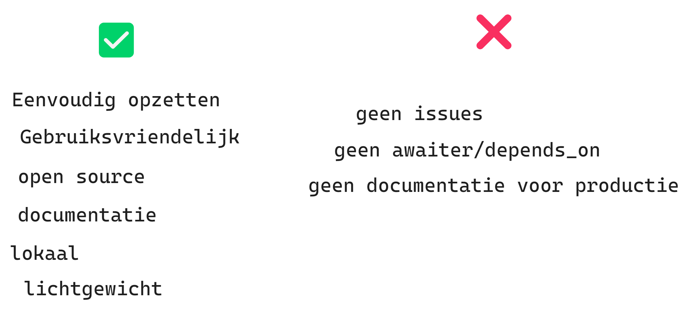

## Hoe verhoudt Gitness zich ten opzichte van andere versiebeheersystemen?

Gitness is een alternatief voor Gitlab en Github, maar legt de nadruk op een eenvoudigere interface en lichtgewicht functionaliteit. </br>
In dat opzicht is Gitness een goed alternatief voor als versiebeheersysteem, maar waar Gitness zich echt onderscheid is de pipeline functionaliteit. Hier is Gitness eenvoudig te gebruiken. Maar waar Github en Gitlab het eenvoudiger maken om een all-in-one oplossing te hebben als compleet project management, is Gitness echt alleen een versiebeheer en pipeline tool. </br>

### Installatie

Het verschil tussen installatie is behoorlijk, Gitness zet je binnen 30s op met behulp van docker, waar je met Gitlab verschillende pagina's aan text moet lezen om het op te zetten. </br>
Zie zo de installatie van Gitlab: </br>
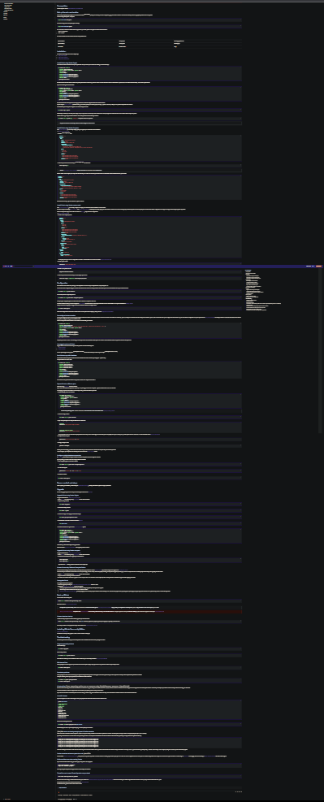

En de installatie van Gitness: </br>


## Conclusie

Gitness is een goed alternatief voor Gitlab en Github, maar legt de nadruk op een eenvoudigere interface en lichtgewicht functionaliteit. </br>
Dus als je op zoek bent naar een alternatieve Git oplossing, dan is Gitness een goede keuze. </br>
Echter is Gitness niet de juiste keuze als je een volledige project-oplossing zoekt zoals Github en Gitlab dat bieden met tickets/issues, projectborden en discussies. </br>

## Bronnen

Tijdens het schrijven van dit blogpost zijn de volgende bronnen, in APA, gebruikt:

<!-- - ICTResearchMethodsPack, 02-10-23. Geraadpleegd op 02-10-23, Vogel, J. (z.d.). ICT Research Methods — Methods Pack for research in ICT. ICT Research Methods. [https://ictresearchmethods.nl/](https://ictresearchmethods.nl/)
- Harness. (2023, 21 september). Harness Releases Gitness -- Open Source Git Platform. prnewswire. Geraadpleegd op 01-10-23, van [prnewswire.com/news-releases/harness-releases-gitness--open-source-git-platform](https://www.prnewswire.com/news-releases/harness-releases-gitness--open-source-git-platform-301934938.html)
- Gitness Homepagina, 01-10-23, Gitness. Geraadpleegd op 01-10-23, van Gitness: Open-Source Code Hosting & CI/CD Pipeline Engine. (z.d.). Gitness. [https://gitness.com/](https://gitness.com/)
- Gitness Docs, 02-10-23, Gitness Docs. Geraadpleegd op 02-10-23, van [docs.gitness.com](https://docs.gitness.com/)
- Gitness Github, 03-10-23, Gitness Github. Geraadpleegd op 03-10-23, van [github.com/harness/gitness](https://github.com/harness/gitness/)
- Harness Github, 02-10-23, Harness Github. Geraadpleegd op 02-10-23, van [github.com/harness](https://github.com/harness/)
- Gitlab installation self hosting, Gitlab Self Hosting. Geraadpleegd op 30-09-23, van [docs.gitlab.com](https://docs.gitlab.com/ee/install/docker.html#install-gitlab-using-docker-compose)
- Gitness product blog, Harness.io. Geraadpleegd op 30-09-23, van [harness.io](https://www.harness.io/blog/gitness-your-ultimate-open-source-development-platform)
- Drone CLI, Drone.io by harness. Geraadpleegd op 05-10-23, van [docs.drone.io](https://docs.drone.io/cli/install/) -->

- ICT Research Methods Pack. (2023, 02 oktober). Geraadpleegd op 02 oktober 2023, van [ICT Research Methods — Methods Pack for research in ICT](https://ictresearchmethods.nl/)
- Harness. (2023, 21 september). Harness Releases Gitness -- Open Source Git Platform. prnewswire. Geraadpleegd op 01 oktober 2023, van [prnewswire.com/news-releases/harness-releases-gitness--open-source-git-platform-301934938.html](https://www.prnewswire.com/news-releases/harness-releases-gitness--open-source-git-platform-301934938.html)
- TechTarget. (2023, 21 september). TechTarget blog. Geraadpleegd op 02 oktober 2023, van [New Git repository faces corporate open source doubts](https://www.techtarget.com/searchsoftwarequality/news/366552837/New-Git-repository-faces-corporate-open-source-doubts)
- Gitness. (2023, 01 oktober). Geraadpleegd op 01 oktober 2023, van [Gitness: Open-Source Code Hosting & CI/CD Pipeline Engine](https://gitness.com/)
- Gitness Docs. (2023, 02 oktober). Geraadpleegd op 02 oktober 2023, van [docs.gitness.com](https://docs.gitness.com/)
- Gitness Github. (2023, 03 oktober). Geraadpleegd op 03 oktober 2023, van [github.com/harness/gitness](https://github.com/harness/gitness/)
- Harness Github. (2023, 02 oktober). Geraadpleegd op 02 oktober 2023, van [github.com/harness](https://github.com/harness/)
- Gitlab Installation Self Hosting. (2023, 30 september). Geraadpleegd op 30 september 2023, van [docs.gitlab.com](https://docs.gitlab.com/ee/install/docker.html#install-gitlab-using-docker-compose)
- Harness.io. (2023, 30 september). Geraadpleegd op 30 september 2023, van [harness.io/blog/gitness-your-ultimate-open-source-development-platform](https://www.harness.io/blog/gitness-your-ultimate-open-source-development-platform)
- Drone.io by Harness. (2023, 05 oktober). Geraadpleegd op 05 oktober 2023, van [docs.drone.io/cli/install/](https://docs.drone.io/cli/install/)
